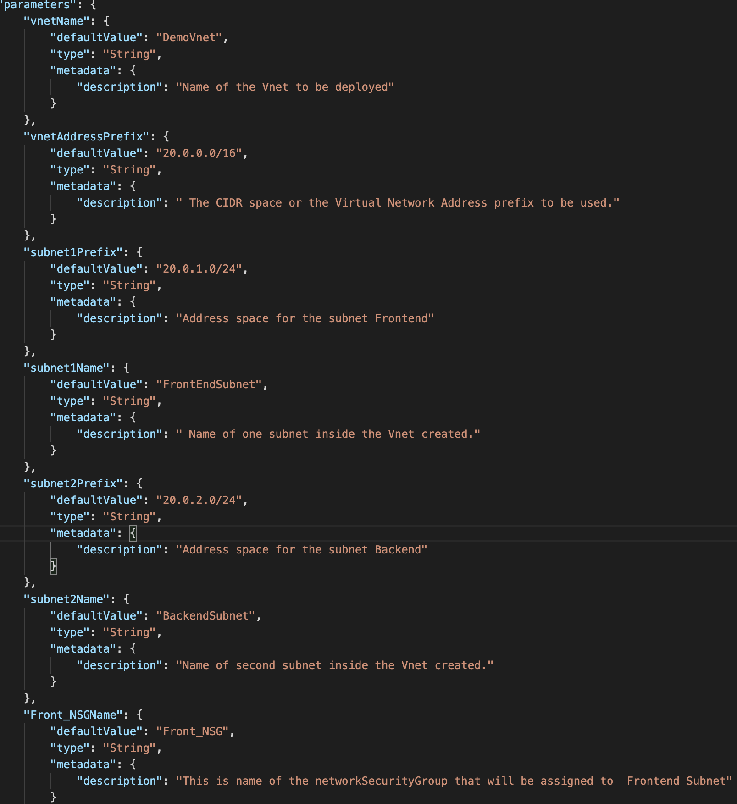
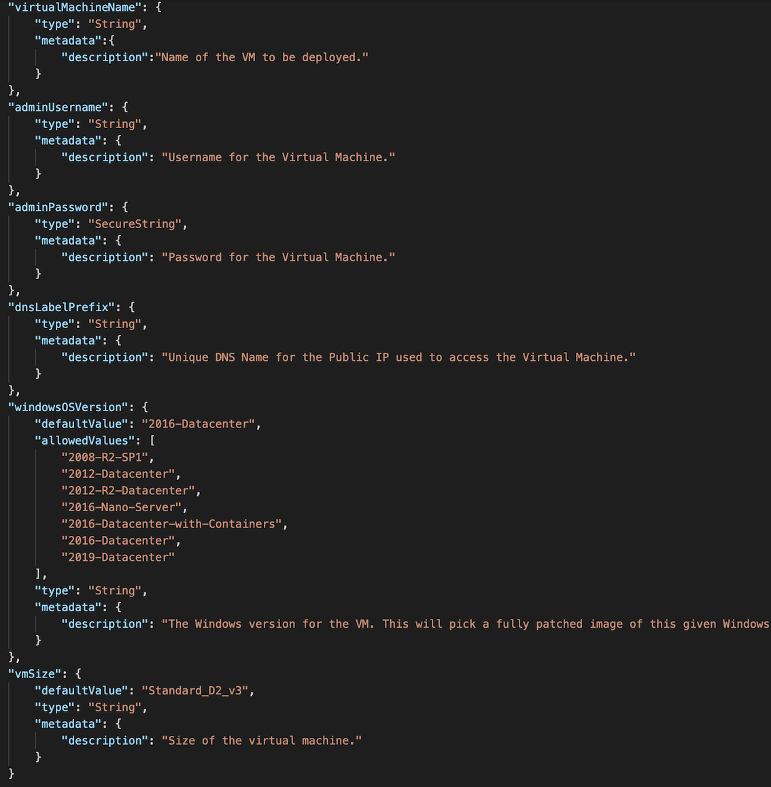
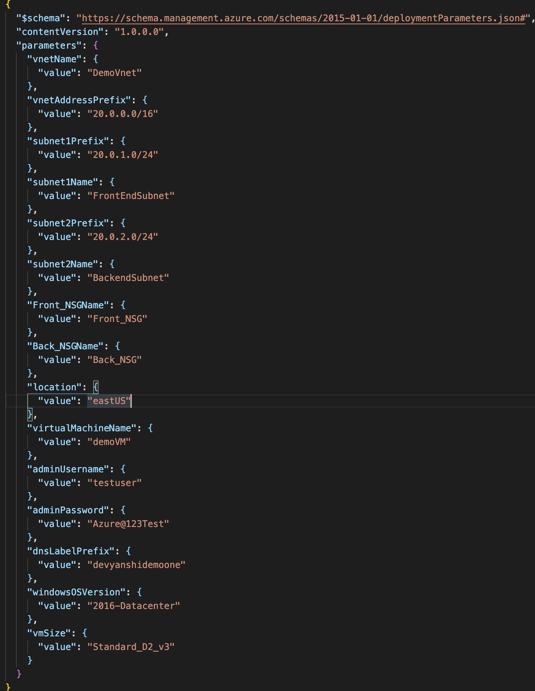
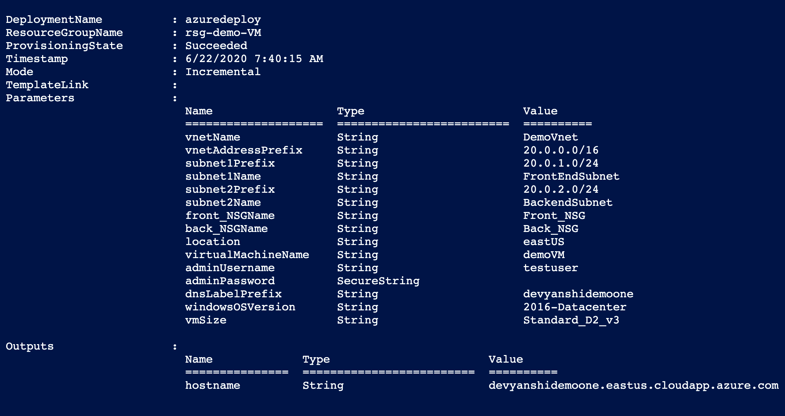
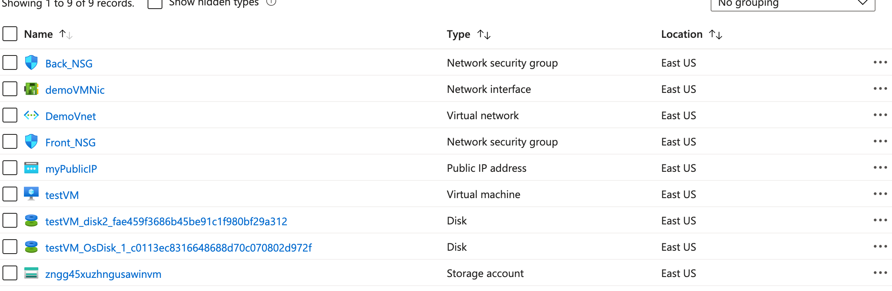

# Azure Resource Manager (ARM) template deployment of Windows Vitrtual Machine

## Azure Resource Manager (ARM) Templates -An Introduction 
<p align="center">

<br />
</p>


 The way of  deploying infrastructure-as-code (IaC) to Azure is  Azure Resource Manager (ARM) Templates  which are the obvious way of doing it simply and repeatedly. They define the objects you want, their types, names and properties in a JSON file which can be understood by the ARM API.<br/>
 An ARM template usually has following sections:<br/>
 1. Parameters
 2. Variables
 3. User Defined Function
 4. Resources
 5. Outputs
 
[ For further details  on ARM templates refer to this link ]( https://docs.microsoft.com/en-us/azure/azure-resource-manager/templates/overview)
####  Context
1. This demo shows how to deploy an windows VM using an ARM templates .<br/>  
2. To deploy a VM we need to assign it to a Virtual Network First.<br/>
3. The azuredeploy template above first creates a Virtual Network with two subnets- Frontend and Backend Subnet.
4. It also assignd Network Security Groups (NSG) to each of the subnets. Figure below shows the template for this deployment<br/>
5. t also assignd Network Security Groups (NSG) to each of the subnets. Figure below shows the  template for this deployment<br/>
                    <p align="center">
                    
                    Figure 1: Template parameters for Vnet
                                <br />
                    </p>
6. The template defines the security rules for both of the subnets.<br/>
7. It assigns Storage account, Network interface, Disks, Public IP address to the VM.<br/>
8. It deploys the VM in the frontend subnet for demonstration purposes and enbles RDP connection for the VM as depicted by the figure below.<br/>
                <p align="center">
                
                Figure 2: Template Parameters for VM
                <br />
                </p>
9. The parameters that needs to be passed by the user are displayed in the parameters.json file. Default values can also be found there.
<p align="center">

Figure 3: Parameter.json file 
<br />
</p> 


# Deeployment Steps
The ARM template created is going to be deployed by using Powershell. <br/>
 PowerShell is a cross-platform task automation and configuration management framework by Microsoft which consists  of a command-line shell and scripting language. <br/>
 PowerShell is built on top of the .NET Common Language Runtime (CLR).<br/>
 [For details on Powershell refer to this link](https://docs.microsoft.com/en-us/powershell/scripting/overview?view=powershell-7)
 
 <p align="center">


<br />
</p> 
 1. Open Powershell for windows and set to path to folder consisting the template files.
 2. Connect to Azure Account.
 3.Then we are going to run a Powershell to test that the ARM template is valid.
 ``` bash
 Test-AzResourceGroupDeployment -ResourceGroupName "name of the resource group" -TemplateFile "yourtemplatefilename".json -Mode incremental -TemplateParameterFile "yourparametersfilename".json
```
4. fter the template is validated we are going to actually deploy the template by the Powershell script
```bash 
New-AzResourceGroupDeployment -ResourceGroupName "name of the resource group" -TemplateFile "yourtemplatefilename".json -Mode incremental -TemplateParameterFile "yourparametersfilename".json
```
Note: All deployments of templates here is in incremental mode.<br/>
In incremental mode, Resource Manager leaves unchanged resources that exist in the resource group but aren't specified in the template. Resources in the template are added to the resource group.<br/>
[For details on modes of ARM template deployments refer to this link](https://docs.microsoft.com/en-us/azure/azure-resource-manager/templates/deployment-modes)
# Output
After the template is succesfully deployed the Powershell will show the details of the deployments.<br/>
<p align="center">

Figure 4: Deployment details on Powershell
<br />
</p>
You can go to Azure portal to further verify that all deployments were successful.

<p align="center">

Figure 5: Deployment summary on Azure Portal
<br />
</p>


# Author
``` Devyanshi Tiwari```

