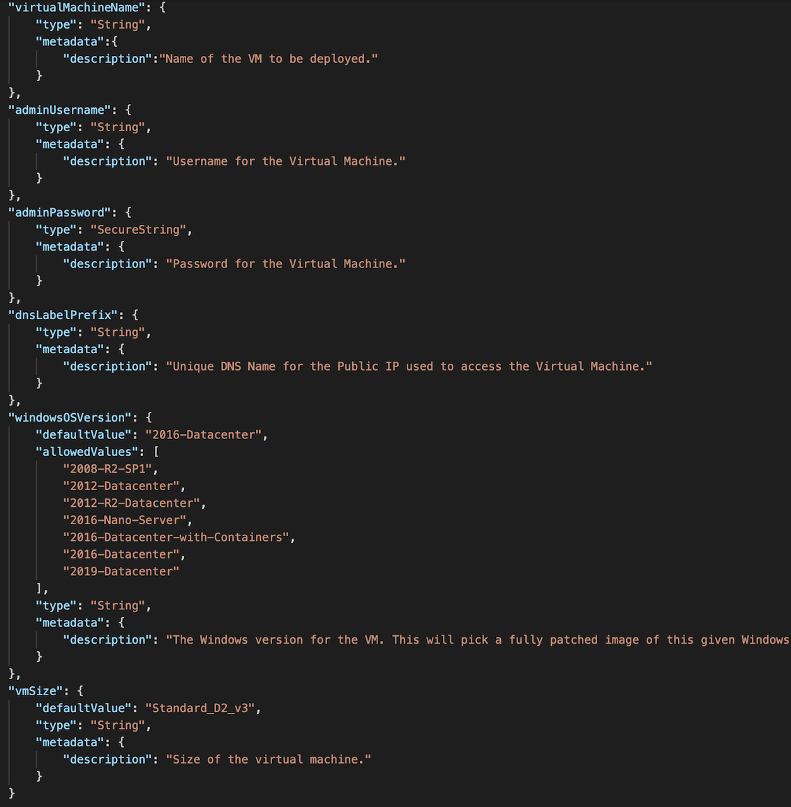
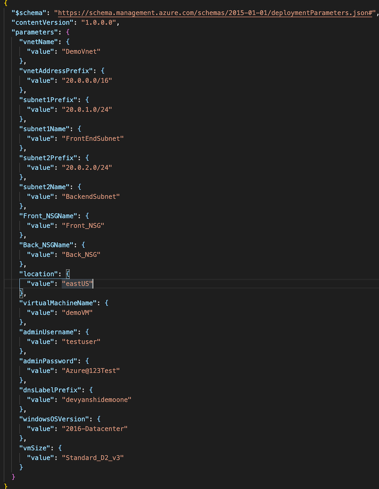
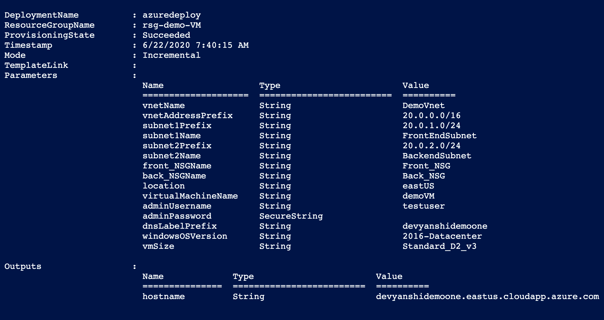
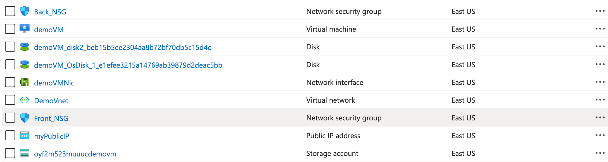

#  Deploy Azure Virtual Machine (Windows) using ARM Template

## Introduction
This demo shows how to deploy an Azure Windows VM using an ARM templates and connect it to a Virtual Network with two subnets- Frontend and Backend Subnet.The template connects the VM to the frontend subnet. It also connects Network Security Groups (NSG) to each of the subnets. 
                    
## Steps to deploy Azure Virtual Machine(VM)

#### 1. ARM Template for deployment

The way of  deploying infrastructure-as-code (IaC) to Azure is Azure Resource Manager (ARM) Templates which are the obvious way of doing it simply and repeatedly. They define the objects you want, their types, names and properties in a JSON file which can be understood by the ARM API.<br/> 
[ For further details  on ARM templates refer to this link ]( https://docs.microsoft.com/en-us/azure/azure-resource-manager/templates/overview)


1. The Figure belows shows the parameters for the Virtual Network Deployment.
                <p align="center">
                
                Figure 1: Template Parameters for Virtual Network
                <br />
                </p>
 
2. The template defines the network security rules for both the frontand backend subnets.<br/>
3. It assigns Storage account, Network interface, Disks, Public IP address to the VM.<br/>
4. It deploys the VM in the frontend subnet for demonstration purposes and enbles RDP connection for the VM as depicted by the figure below.<br/>
                <p align="center">
                
                Figure 2: Template Parameters for VM
                <br />
                </p>
5. The parameters that needs to be passed by the user are displayed in the parameters.json file. Default values can also be found there.<br/>
               <p align="center">
                
                Figure 3: Parameters.json file 
                <br />
                </p>

      
### 2. Steps to deploy
 The ARM template created is going to be deployed by using Powershell. <br/>
 PowerShell is a cross-platform task automation and configuration management framework by Microsoft which consists  of a command-line shell and scripting language. <br/>
 PowerShell is built on top of the .NET Common Language Runtime (CLR).<br/>
 [For details on Powershell refer to this link](https://docs.microsoft.com/en-us/powershell/scripting/overview?view=powershell-7)

 1. Open Powershell for windows and set the path to folder consisting the template files.
 2. Connect to Azure Account by the below command .You will be provided with a link and code. Go to the link and enter the code to connect.<br/>
 ```bash 
 connect-AzAccount
 ```
 
 3. Then we are going to run a Powershell  script to test that the ARM template is valid.
 ``` bash
 Test-AzResourceGroupDeployment -ResourceGroupName "name of the resource group" -TemplateFile "yourtemplatefilename".json -Mode incremental -TemplateParameterFile "yourparametersfilename".json
```
4. After the template is validated we are going to actually deploy the template by the Powershell script
```bash 
New-AzResourceGroupDeployment -ResourceGroupName "name of the resource group" -TemplateFile "yourtemplatefilename".json -Mode incremental -TemplateParameterFile "yourparametersfilename".json
```

 <b>Note:</b> All deployments of templates here are in incremental mode.<br/>
In incremental mode, Resource Manager (RM) leaves unchanged resources that exist in the resource group but aren't specified in the template. Resources in the templates are added to the resource group.<br/>
[For details on modes of ARM template deployments refer to this link](https://docs.microsoft.com/en-us/azure/azure-resource-manager/templates/deployment-modes)

#### Output
After the template is succesfully deployed ,the Powershell will show the details of the deployments.<br/>
<p align="center">

Figure 4: Deployment details on Powershell
<br />
</p>
You can go to Azure portal to further verify that all of the deployments were successful.

<p align="center">

Figure 5: Deployment summary on the Azure Portal
<br />
</p>

